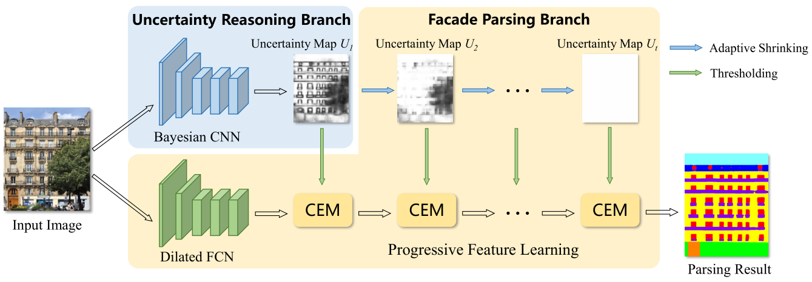

# PFLNet: Progressive Feature Learning for Facade Parsing with Occlusions

This project contains the Tensorflow implementation for the proposed PFLNet: [[IEEE Xplore]](https://ieeexplore.ieee.org/document/9097171).

### Introduction
Existing deep models for facade parsing often fail in classifying samples in heavily occluded regions of facade images, due to the difficulty in feature representation of these samples. In this paper, we solve the facade parsing with occlusions by progressive feature learning. To this end, we locate the regions contaminated by occlusions via Bayesian uncertainty evaluation on categorizing each sample. Then, guided by the uncertainty, we propose an occlusion-immune facade parsing architecture, in which we progressively re-express the features of samples in each contaminated region from easy to hard. To be specific, the outside samples, which have reliable context from visible areas, are re-expressed at early stages; the inner samples are processed at late stages when their surroundings have been decontaminated at the earlier stages. In addition, at each stage, instead of using regular square convolution kernels, we design a context enhancement module (CEM) with directional strip kernels, which can aggregate structural context to re-express facade samples. Extensive experiments on popular facade datasets demonstrate that the proposed method achieves state-of-the-art performance.
<p align="center"></p>

### Installation
- Env: Python 3.6; TensorFlow 0.5-1.5; CUDA 9.0; cuDNN
- Install some packages
```
pip install opencv-python pillow numpy matplotlib imageio .....
```
- Clone this repository
```
git clone https://github.com/wohaiyo/PFLNet
cd PFLNet
```
- One GPU with 11GB is needed

### Dataset
You need to download the two dataset——ECP and RueMonge2014, and put the files in the `data` folder with following structure.
```
├── ecp
|    |── ecp1
|    |   ├── train
|    |   |   ├── img
|    |   |   └── label
|    |   ├── val
|    |   |   ├── img
|    |   |   └── label
|    |   ├── train.txt
|    |   └── val.txt
|    |── ecp2
|    |   ├── train
|    |   |   ├── img
|    |   |   └── label
|    |   ├── val
|    |   |   ├── img
|    |   |   └── label
|    |   ├── train.txt
|    |   └── val.txt
|    |── ecp3
|    |   ├── train
|    |   |   ├── img
|    |   |   └── label
|    |   ├── val
|    |   |   ├── img
|    |   |   └── label
|    |   ├── train.txt
|    |   └── val.txt
|    |── ecp4
|    |   ├── train
|    |   |   ├── img
|    |   |   └── label
|    |   ├── val
|    |   |   ├── img
|    |   |   └── label
|    |   ├── train.txt
|    |   └── val.txt
|    |── ecp5
|    |   ├── train
|    |   |   ├── img
|    |   |   └── label
|    |   ├── val
|    |   |   ├── img
|    |   |   └── label
|    |   ├── train.txt
|    |   └── val.txt
├── RueMonge2014
|    ├── train
|    |    ├── img
|    |    └── label
|    ├── val
|    |    ├── img
|    |    └── label
|    ├── train.txt
|    └── val.txt           
```

### Training

- You can run: `python train.py -h` to check the detail of optional arguments.
Basically, in the `config.py`, you can set the dataset, train type, epochs and batch size, etc.
```
python train.py
```
- training on Cityscapes train set


### Testing
- After training, the checkpoint will be saved at `saves` folder, you can use `eval.py` to get the result.
```
python eval.py
```

### Citation

Please consider citing the [Pyramid ALKNet](https://ieeexplore.ieee.org/document/9097171) if it's helpful for your research.
```
@article{ma2020pyramid,
  title={Pyramid ALKNet for Semantic Parsing of Building Facade Image},
  author={Ma, Wenguang and Ma, Wei and Xu, Shibiao and Zha, Hongbin},
  booktitle={IEEE Geoscience and Remote Sensing Letters},
  year={2020},
  publisher={IEEE}
}